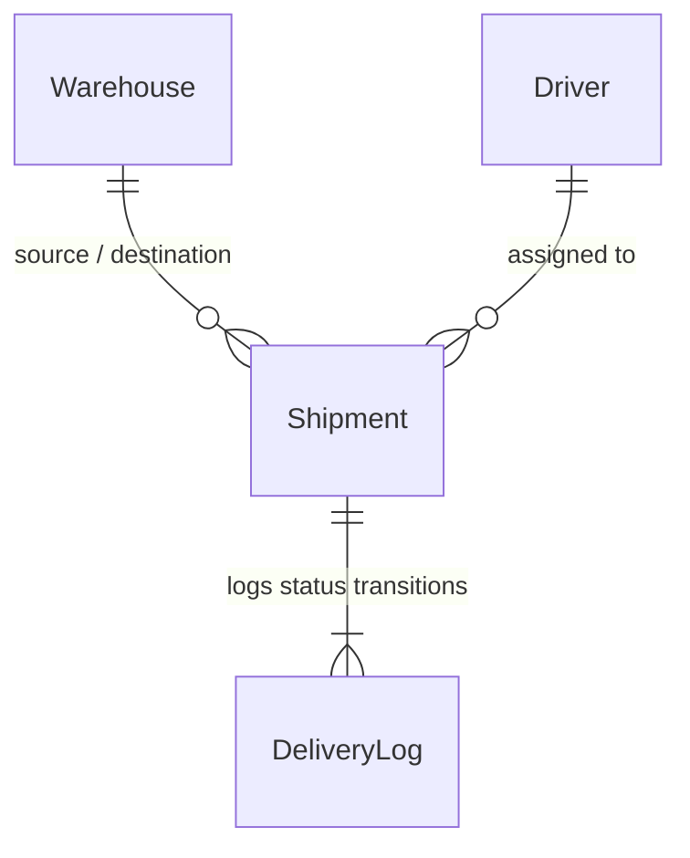

# LogiFlow – Smart Logistics & Supply Chain Management System

LogiFlow is an enterprise-grade logistics, fleet management, and supply chain tracking platform. It simplifies shipment tracking, warehouse utilization, and driver dispatching through automated scheduling, geographical route optimization, and real-time validation checks. 

Developed with a Node.js/Express backend, MongoDB database layer, and a rich dark-mode React frontend, LogiFlow features an integrated AI-driven chatbot assistant and custom route sequencing algorithms.

---

## 🚀 Key Features

*   **Priority-Sorted Geographical Route Optimization**: Custom route optimization engine utilizing the **Haversine formula** and a **Nearest-Neighbor heuristic** to sequence driver deliveries efficiently.
*   **Smart Auto-Dispatcher & Queueing**: State-machine-based automated queue system managing shipment lifecycles (`PENDING` ➔ `QUEUED` ➔ `IN_TRANSIT` ➔ `DELIVERED`).
*   **Real-time Warehouse Capacity Management**: Strict validation checks that calculate and update warehouse storage capacity upon shipment creation, status transition, or deletion.
*   **Role-Based Access Control (RBAC)**: Secure routing structure with role validation for `ADMIN`, `MANAGER`, and `DRIVER` roles.
*   **Interactive Analytics Dashboard**: Live metrics counting active shipments, delivery status trends, active drivers, and warehouse fill rates.
*   **AI Logistics Assistant**: Real-time conversational AI bot using Llama 3 (via Groq API) for answering logistics queries and summarizing data.

---

## 🛠 Tech Stack

*   **Frontend**: React.js, Vite, Tailwind CSS, Axios, Lucide Icons, Recharts, Leaflet.js
*   **Backend**: Node.js, Express.js
*   **Database**: MongoDB with Mongoose ODM
*   **Security & Auth**: JSON Web Tokens (JWT), bcrypt hashing
*   **AI Engine**: Groq API (Llama-3.3-70b-versatile model)

---

## 📁 System Architecture & Directory Structure

```text
logiflow/
├── backend/
│   ├── seed.js             # MongoDB seed data script
│   ├── src/
│   │   ├── controllers/    # API controllers (Business logic)
│   │   │   ├── aiController.js         # Chatbot interaction
│   │   │   ├── analyticsController.js  # Dashboard aggregations
│   │   │   ├── authController.js       # Register, login, token refresh
│   │   │   ├── driverController.js     # Driver CRUD & cascading deletes
│   │   │   ├── shipmentController.js   # Optimization & auto-dispatch logic
│   │   │   └── warehouseController.js  # Warehouse CRUD & capacity math
│   │   ├── middleware/     # Auth and RBAC middleware
│   │   ├── models/         # MongoDB schema models (Mongoose)
│   │   ├── routes/         # Express endpoint definitions
│   │   │   ├── aiRoutes.js
│   │   │   ├── analyticsRoutes.js
│   │   │   ├── authRoutes.js
│   │   │   ├── driverRoutes.js
│   │   │   ├── shipmentRoutes.js
│   │   │   └── warehouseRoutes.js
│   │   └── server.js       # Express server entry point
│   └── .env                # Server configurations
└── frontend/
    ├── src/
    │   ├── components/     # UI elements (Cards, Dialogs, Charts)
    │   ├── context/        # Authentication state context
    │   ├── pages/          # App views (Dashboard, Shipments, Fleet)
    │   ├── services/       # Axios API client integrations
    │   └── App.jsx         # React Router and main layout
```

### Database Relations Model


---

## 🧠 Advanced Engineering Implementation Details

### 1. Route Optimization & Distance Math
To minimize transit time and fuel consumption, the system resolves a version of the Traveling Salesperson Problem (TSP) using a greedy heuristic.
*   **Haversine Formula**: Calculates the exact great-circle distance between two warehouses on a sphere using their latitude and longitude coordinates:
    $$d = 2R \arcsin\left(\sqrt{\sin^2\left(\frac{\Delta \text{lat}}{2}\right) + \cos(\text{lat}_1)\cos(\text{lat}_2)\sin^2\left(\frac{\Delta \text{lon}}{2}\right)}\right)$$
*   **Nearest-Neighbor Sequence**: The optimizer groups shipments assigned to a driver by priority (`Urgent` ➔ `High` ➔ `Normal` ➔ `Low`). Within the highest remaining priority tier, it runs a Nearest-Neighbor search starting from the driver's current position to determine the shortest geographical sequence.

### 2. Auto-Dispatcher State Machine
To prevent driver scheduling conflicts:
*   Drivers can have only **one** active shipment `IN_TRANSIT`.
*   Subsequent shipments assigned to the same driver are kept in a `QUEUED` state.
*   When an active shipment transitions to `DELIVERED`, the server automatically fires an auto-dispatcher cycle that queries the driver's queue, runs the route optimizer, and auto-dispatches the next optimized shipment to `IN_TRANSIT`.

### 3. Transactional Capacity Integrity
To prevent database inconsistency and physical warehouse overflows, shipment weight changes trigger automatic capacity adjustments:
*   **Creation**: Validates that source warehouse usage + shipment weight does not exceed capacity. If valid, reserves the space.
*   **In-Transit**: Free up space in the source warehouse since the cargo physically left.
*   **Delivered**: Consumes space in the destination warehouse.
*   **Rollback / Deletion**: Reverts/credits the capacity values back to the warehouses automatically.
*   **Cascading Driver Cleanup**: Deleting a driver automatically resets their active shipments back to `PENDING` and unassigns the ID (`null`) to maintain database integrity.

---

## 🔐 Security & Role-Based Access Control (RBAC)

All endpoints (except auth routes) are protected by a JWT authorization header (`Authorization: Bearer <token>`). The table below outlines the access control matrix:

| Endpoint | Method | Admin | Manager | Driver | Description |
| :--- | :--- | :---: | :---: | :---: | :--- |
| `/api/auth/register` | `POST` | ✔ | ✖ | ✖ | Create new user profiles |
| `/api/auth/login` | `POST` | ✔ | ✔ | ✔ | Public authentication endpoint |
| `/api/warehouses` | `GET` | ✔ | ✔ | ✔ | Fetch list of warehouses |
| `/api/warehouses` | `POST` | ✔ | ✔ | ✖ | Add new warehouse (with coords) |
| `/api/warehouses/:id` | `PUT` | ✔ | ✔ | ✖ | Update warehouse fields |
| `/api/warehouses/:id` | `DELETE`| ✔ | ✖ | ✖ | Delete warehouse |
| `/api/drivers` | `GET` | ✔ | ✔ | ✔ | List all drivers & active routes |
| `/api/drivers` | `POST` | ✔ | ✔ | ✖ | Create driver profile |
| `/api/drivers/:id` | `PUT/DELETE`| ✔ | ✔ | ✖ | Modify/Remove driver |
| `/api/shipments` | `GET` | ✔ | ✔ | ✔ | Retrieve all shipments |
| `/api/shipments` | `POST` | ✔ | ✔ | ✖ | Create shipment (capacity checks) |
| `/api/shipments/:id/status`| `PATCH`| ✔ | ✔ | ✔ | Transition shipment states |
| `/api/shipments/:id` | `DELETE`| ✔ | ✔ | ✖ | Delete shipment & rollback usage |
| `/api/shipments/driver/:driverId/optimize` | `GET` | ✔ | ✔ | ✔ | Fetch optimized route sequence |
| `/api/analytics/dashboard` | `GET` | ✔ | ✔ | ✖ | Access dashboards and metrics |
| `/api/ai/chat` | `POST` | ✔ | ✔ | ✔ | Submit messages to AI assistant |

---

## ⚙️ Setup & Installation Instructions

### Prerequisites
*   [Node.js](https://nodejs.org/) (v16.0.0 or higher)
*   [MongoDB](https://www.mongodb.com/) (Local installation or Atlas Cluster connection string)
*   [Groq API Key](https://console.groq.com/) (Required for AI assistant features)

### 1. Environment Configurations
Create a `.env` file inside the `backend` directory based on the `.env.example` template:

```env
NODE_ENV=development
PORT=5000
MONGO_URI=mongodb+srv://<username>:<password>@cluster.mongodb.net/logiflow
JWT_SECRET=your_jwt_secret_key_here
JWT_EXPIRES_IN=15m
JWT_REFRESH_SECRET=your_jwt_refresh_key_here
JWT_REFRESH_EXPIRES_IN=7d
CLIENT_URL=http://localhost:5173
GROQ_API_KEY=gsk_your_groq_api_key_goes_here
```

### 2. Backend Setup
1.  Navigate into the backend folder:
    ```bash
    cd backend
    ```
2.  Install dependencies:
    ```bash
    npm install
    ```
3.  Seed mock warehouses, drivers, and user accounts:
    ```bash
    node seed.js
    ```
4.  Launch the development server:
    ```bash
    npm run dev
    ```
    *The server runs on `http://localhost:5000`.*

### 3. Frontend Setup
1.  Navigate into the frontend folder:
    ```bash
    cd ../frontend
    ```
2.  Install dependencies:
    ```bash
    npm install
    ```
3.  Start the Vite application:
    ```bash
    npm run dev
    ```
    *Open `http://localhost:5173` in your browser.*

---

## 📊 API Verification Examples

### Creating a Shipment (POST `/api/shipments`)
*   **Headers**: `Authorization: Bearer <JWT>`
*   **Request Body**:
    ```json
    {
      "source": "Delhi Warehouse Hub",
      "destination": "Mumbai Logistics Center",
      "weight": 250,
      "priority": "High",
      "driverId": "64efc354784a9e525419ab03"
    }
    ```
*   **Success Response (201 Created)**:
    ```json
    {
      "id": "65ef49a4f475d691bc2ab493",
      "trackingNumber": "SHP-X92F4A7B",
      "source": "Delhi Warehouse Hub",
      "destination": "Mumbai Logistics Center",
      "weight": 250,
      "priority": "High",
      "status": "QUEUED",
      "driver": { "id": "64efc354784a9e525419ab03", "name": "Rajesh Kumar" },
      "deliveryLogs": [
        { "status": "QUEUED", "notes": "Shipment created", "timestamp": "2026-05-22T05:00:00Z" }
      ]
    }
    ```

---
*Developed for academic evaluation and system design demonstration.*
